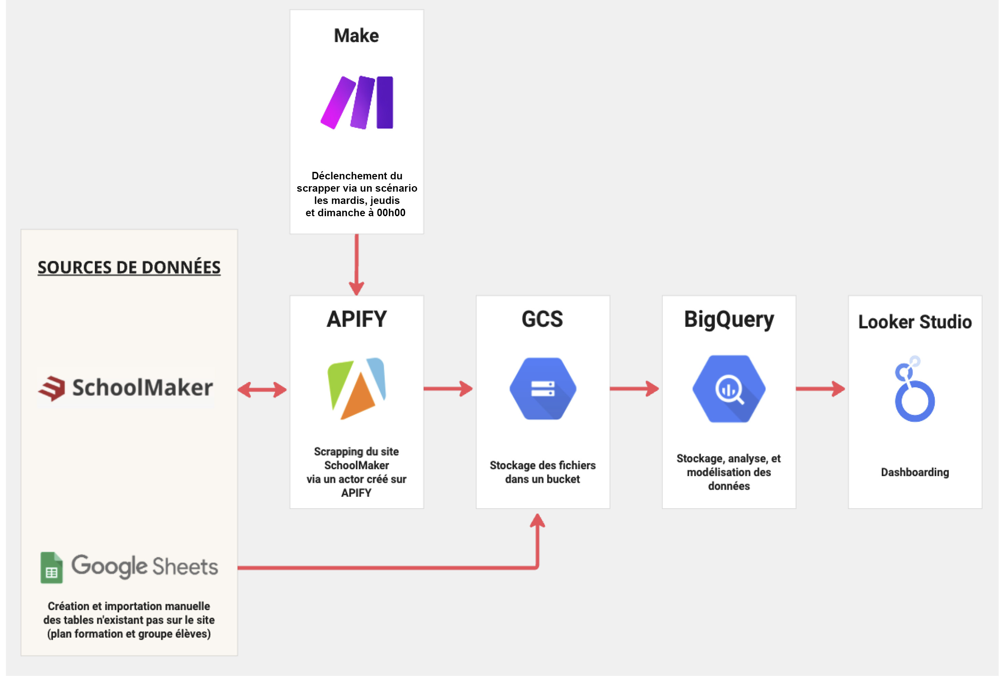
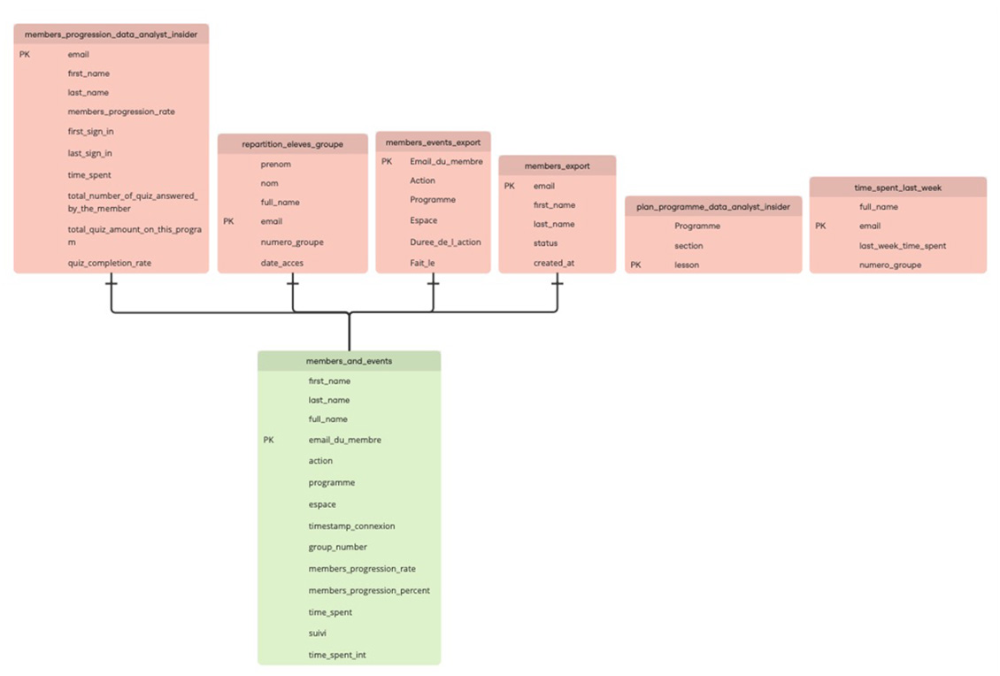

# 📊 NextGen Learning – Suivi de l’assiduité et de la progression sur Schoolmaker

---

## 📑 Sommaire

- [1. Contexte](#contexte)
- [2. Objectifs](#objectifs)
- [3. Sources de données](#sources-de-donnees)
  - [3.1 Origine](#origine)
  - [3.2 Description des données](#description-des-donnees)
- [4. Structuration, ingestion et intégration des sources](#structuration-ingestion)
  - [4.1 Processus d’ingestion automatisé](#processus-ingestion)
  - [4.2 Pilotage de l’actor Apify par Make](#pilotage-apify-make)
  - [4.3 Chargement et stockage dans Google Cloud Storage](#chargement-gcs)
  - [4.4 Création de la table `members_and_events`](#creation-members-events)
  - [4.5 Création des vues analytiques](#creation-vues-analytiques)
  - [4.6 Archivage et calcul du temps hebdomadaire](#archivage-temps-hebdomadaire)
- [5. Analyse et traitement des données](#analyse-traitement)
  - [5.1 Nettoyage et enrichissement](#nettoyage-enrichissement)
  - [5.2 Préparation des tables analytiques](#preparation-tables)
  - [5.3 Tables et vues analytiques dérivées pour le dashboard](#tables-et-vue)
- [6. Construction des indicateurs](#construction-indicateurs)
  - [6.1 Temps passé et jours travaillés](#temps-passe-jours-travailles)
  - [6.2 Activité et progression des membres](#activite-progression)
  - [6.3 Connexions hebdomadaires, mensuelles et individualisées](#connexions)
  - [6.4 Taux d’engagement global](#taux-engagement)
- [7. Visualisation et dashboard](#visualisation-dashboard)
  - [7.1 Objectif du dashboard](#objectif-dashboard)
  - [7.2 Structure du rapport Looker Studio](#structure-dashboard)
  - [7.3 Indicateurs principaux visualisés](#indicateurs-principaux)
  - [7.4 Filtres et interactions](#filtres-interactions)
  - [7.5 Accès au dashboard interactif](#acces-dashboard)
- [8. Conclusion](#conclusion)
  - [8.1 Limites et contraintes](#limites-contraintes)
  - [8.2 Pistes d’amélioration](#pistes-amelioration)

---

<a id="contexte"></a>
## 1. 🧭 Contexte
Dans le cadre du suivi des apprenants sur la plateforme **Schoolmaker**, ce projet a pour objectif d’analyser et de visualiser les données d’activité des membres inscrits à la formation **Data Analyst Insider** de NextGen Learning.  
L’enjeu principal est de mieux comprendre le niveau d’engagement, l’avancement et la régularité des apprenants dans leur parcours de formation.

Le projet repose sur la création d’un **dashboard interactif** regroupant plusieurs indicateurs clés, organisés autour de trois axes :  
- **Engagement** : mesure de l’activité et du temps passé sur la plateforme.  
- **Avancement** : suivi de la progression dans la formation *Data Analyst Insider*.  
- **Régularité** : analyse de la fréquence et de la constance des connexions dans le temps.

Ce tableau de bord offre une **vision synthétique et dynamique** de la participation des membres, facilitant le pilotage pédagogique et la détection précoce des signaux de décrochage.

---

<a id="objectifs"></a>
## 2. 🎯 Objectifs
Le projet poursuit plusieurs objectifs complémentaires :  
1. **Mesurer l’engagement** des apprenants sur la plateforme Schoolmaker à travers des indicateurs d’activité, de durée de connexion et de fréquentation récente (sur les 7 et 30 derniers jours).  
2. **Suivre l’avancement** individuel et collectif dans la formation *Data Analyst Insider* afin de repérer les membres les plus assidus et ceux nécessitant un accompagnement.  
3. **Analyser la régularité** des connexions pour identifier les tendances d’assiduité et anticiper les baisses d’implication.  
4. **Mettre à disposition un outil visuel et interactif** facilitant la lecture des données pour les formateurs.

---

<a id="sources-de-donnees"></a>
## 3. 🧱 Sources de données

<a id="origine"></a>
### 3.1 Origine

Les données proviennent de deux sources principales :

- **Schoolmaker**  
  Plateforme de formation en ligne utilisée par NextGen Learning pour héberger le programme *Data Analyst Insider*.  

- **Fichiers CSV créés manuellement**  
  Certains fichiers, non disponibles sur Schoolmaker, sont ajoutés manuellement pour compléter les jeux de données.  

---

<a id="description-des-donnees"></a>
### 3.2 Description des données

#### 3.2.1 Tables issues de Schoolmaker

##### a. Structure de la table `members_progression_data_analyst_insider`

| Nom du champ | Type | Description |
|---------------|-------|-------------|
| `email` | STRING | Adresse e-mail du membre. |
| `first_name` | STRING | Prénom du membre. |
| `last_name` | STRING | Nom de famille du membre. |
| `members_progression_rate` | INTEGER | Taux de progression du membre dans le programme (en pourcentage). |
| `first_sign_in` | TIMESTAMP | Date et heure de la première connexion du membre. |
| `last_sign_in` | TIMESTAMP | Date et heure de la dernière connexion du membre. |
| `time_spent` | STRING | Temps total passé par le membre sur la plateforme (au format texte). |
| `total_number_of_quiz_answered_by_the_member` | INTEGER | Nombre total de quiz complétés par le membre. |
| `total_quiz_amount_on_this_program` | INTEGER | Nombre total de quiz disponibles dans le programme. |
| `quiz_completion_rate` | FLOAT | Taux de complétion des quiz par le membre (valeur décimale). |

##### b. Structure de la table `members_export`

| Nom du champ | Type | Description |
|---------------|-------|-------------|
| `email` | STRING | Adresse e-mail du membre. |
| `first_name` | STRING | Prénom du membre. |
| `last_name` | STRING | Nom de famille du membre. |
| `status` | STRING | Statut du membre. |
| `created_at` | TIMESTAMP | Date et heure de création de l’enregistrement. |

##### c. Structure de la table `members_events_export`

| Nom du champ | Type | Description |
|---------------|-------|-------------|
| `Email_du_membre` | STRING | Adresse e-mail du membre ayant réalisé l’action. |
| `Action` | STRING | Type d’action effectuée par le membre (ex. connexion, déconnexion, consultation de la leçon, etc.). |
| `Programme` | STRING | Nom du programme auquel l’action est associée. |
| `Espace` | STRING | Espace ou section de la plateforme où l’action a eu lieu. |
| `Duree_de_l_action` | TIME | Durée de l’action réalisée par le membre. |
| `IP` | STRING | Adresse IP depuis laquelle l’action a été effectuée. |
| `Fait_le` | STRING | Horodatage de l’action. |

---

#### 3.2.2 Fichiers CSV créés manuellement

##### a. Structure de la table `plan_programme_data_analyst_insider`

| Nom du champ | Type | Description |
|--------------|--------|---------------------------------------------|
| `programme` | STRING | Nom du programme concerné. |
| `section` | STRING | Nom de la section à laquelle la leçon appartient. |
| `lesson` | STRING | Nom ou identifiant de la leçon. |

##### b. Structure de la table `repartition_eleves_groupe`

| Nom du champ | Type | Description |
|-----------------|--------|---------------------------------------------|
| `prenom` | STRING | Prénom du membre. |
| `nom` | STRING | Nom de famille du membre. |
| `full_name` | STRING | Nom complet du membre (concaténation du prénom et du nom). |
| `email` | STRING | Adresse e-mail du membre. |
| `numero_groupe` | STRING | Numéro ou identifiant du groupe auquel le membre appartient. |
| `date_acces` | DATE | Date d’accès ou d’inscription du membre. |

---

<a id="structuration-ingestion"></a>
## 4. 🔗 Structuration, ingestion et intégration des sources

<a id="processus-ingestion"></a>
### 4.1 🔄 Processus d’ingestion automatisé

Les données utilisées pour ce projet sont extraites automatiquement depuis **Schoolmaker** à l’aide d’un pipeline combinant **Apify** et **Make**.

- **Apify** exécute un *actor* dédié, configuré pour extraire les informations de la plateforme (progression, activités, événements des membres, etc.).  
- **Make** orchestre le processus : il **pilote l’exécution de l’actor Apify** et assure la planification des extractions.  
- Pour rester dans les limites du **plan gratuit d’Apify**, le scénario Make déclenche l’actor **trois fois par semaine** :  
  **le mardi, le jeudi et le dimanche.**

À chaque exécution :
1. L’actor Apify récupère les données depuis Schoolmaker (via scraping).  
2. Les résultats sont exportés automatiquement au format **CSV**.  
3. Apify dépose les fichiers directement dans le bucket de stockage du projet, où ils sont ensuite utilisés tels quels pour l’analyse.

Ce flux d’automatisation permet :  

- **Actualiser régulièrement les données sans intervention manuelle** : les extractions sont programmées et déposées automatiquement dans le bucket, garantissant des mises à jour fréquentes.  
- **Assurer la cohérence entre les exports** : toutes les tables sont générées dans les mêmes conditions, évitant les décalages ou incohérences entre sources.  
- **Réduire la charge opérationnelle** : le processus reste léger et entièrement automatisé, tout en respectant les limites du plan gratuit d’Apify.

---

<a id="pilotage-apify-make"></a>
### 4.2 📦 Utilisation et historisation des fichiers extraits

Les fichiers CSV produits par Apify sont utilisés **en l’état**, sans transformation ni nettoyage intermédiaire.  
Chaque extraction génère les tables nécessaires à l’analyse :
- `members_export`  
- `members_progression_data_analyst_insider`  
- `members_events_export`  

#### 🗃️ Gestion de l’historique des extractions

Lors de chaque envoi de fichiers vers le bucket Google Cloud, un **dossier d’historique** (`historic`) est automatiquement mis à jour.  
Ce dossier :

- **répertorie l’ensemble des fichiers CSV envoyés** par Apify (sans suppression des précédents) ;  
- **permet de conserver une trace complète** de toutes les extractions passées ;  
- **garantit la traçabilité et la reproductibilité** des analyses dans le temps.

Ainsi, le bucket contient à la fois :
- les fichiers **actifs** utilisés pour alimenter les vues dans BigQuery,  
- et le **fichier d’historique cumulatif**, qui agit comme une **archive temporelle** des extractions automatisées.

#### ⏱️ Exploitation analytique de l’historique

Au-delà de la simple conservation des fichiers, cet archivage joue un **rôle analytique essentiel** :  
il permet de **mesurer l’évolution du temps passé** par chaque membre sur la formation *Data Analyst Insider* entre deux dates d’extraction.

Concrètement :
- Les données extraites à **J** et **J-7** sont comparées pour estimer le **temps total passé sur les 7 derniers jours**.  
- Cette méthode évite d’avoir à recalculer les durées à partir des événements bruts, tout en assurant une **cohérence temporelle** dans le suivi de l’activité.

Ce mécanisme alimente directement certaines vues du tableau de bord, notamment celles relatives à la **régularité** et à l’**engagement hebdomadaire** des membres.

#### 🗺️ Schéma de fonctionnement global

Le diagramme ci-dessous illustre le pipeline complet d’ingestion et de traitement des données, depuis l’extraction automatisée sur **Schoolmaker** jusqu’à la **construction du dashboard final** :



Ces fichiers sont ensuite intégrés directement dans le processus d’analyse et servent à construire la **vue centrale `membres_ans_events`**.


>Les tables `members_progression_data_analyst_insider`, `members_export`, `members_events_export` et `repartition_eleves_groupe` sont utilisées conjointement pour construire une **vue unifiée** servant de base à toutes les analyses.

| Table | Description | Type de données |
|--------|--------------|-----------------|
| `members_export` | Contient les informations générales sur les membres (identité, email, date d’inscription, statut, etc.) | Données utilisateurs |
| `members_progression_data_analyst_insider` | Données de suivi de la progression des membres dans la formation *Data Analyst Insider* (taux de complétion, temps passé, date de dernière activité) | Données de progression |
| `members_events_export` | Historique détaillé des événements enregistrés sur la plateforme : connexions, actions effectuées, dates et durées de session | Données d’activité |
| `repartition_eleves_groupe` | Répartition des apprenants selon leur groupe ou cohorte d’appartenance | Données organisationnelles |

---

<a id="chargement-gcs"></a>
### 4.3 🧩 Création de la vue centrale `membres_ans_events`

Afin de faciliter les jointures et les calculs transversaux, ces tables ont été intégrées dans une **vue consolidée** nommée `membres_ans_events`.  
Cette vue représente la **source centrale** du projet et sert de base unique pour l’ensemble des calculs d’indicateurs et des visualisations.

#### 🎯 Objectifs de la vue

- **Centraliser** toutes les informations relatives aux apprenants : profil, progression, activité et appartenance à un groupe.  
- **Assurer la cohérence et la fiabilité des données** en évitant les doublons ou incohérences entre exports.  
- **Simplifier les analyses** en disposant d’une seule table de référence pour les calculs d’engagement, de régularité et d’avancement.

#### ⚙️ Construction de la vue

| Source | Clé de jointure | Rôle dans la vue |
|---------|----------------|------------------|
| `members_export` | `email` | Fournit les informations d’identification et les métadonnées des membres. |
| `members_progression_data_analyst_insider` | `email` | Apporte les données de progression dans la formation. |
| `members_events_export` | `email_du_membre` | Détaille les événements liés à l’activité du membre sur la plateforme. |
| `repartition_eleves_groupe` | `email` | Permet de rattacher chaque membre à sa cohorte. |

---

<a id="creation-members-events"></a>
### 4.4 🗺️ Schéma relationnel du projet

Le diagramme ci-dessous illustre les relations entre les différentes tables sources et la création de la vue `membres_ans_events` :




---

<a id="creation-vues-analytiques"></a>
### 4.5 💡 Utilisation analytique de la vue

La vue `membres_ans_events` est utilisée comme **table principale** pour :

- **Agréger les données d’activité** (nombre de connexions, durée totale) ;  
- **Calculer les indicateurs d’assiduité, de régularité et d’engagement** ;  
- **Suivre la progression** des membres dans la formation *Data Analyst Insider* ;  
- **Servir de base de création** pour l’ensemble des vues intermédiaires correspondant aux différents volets du **dashboard** :
  - **Engagement**
  - **Avancement**
  - **Régularité**

> 🧩 **Vue pivot du projet :**  
> `membres_ans_events` centralise toutes les données nécessaires à la génération des indicateurs et des visualisations, garantissant la cohérence et la fiabilité de l’analyse.

---

<a id="archivage-temps-hebdomadaire"></a>
### 4.6 – Archivage et calcul du temps hebdomadaire

Lors de l’envoi des fichiers CSV extraits par Apify vers le bucket Google Cloud, un **fichier d’archive** est créé pour conserver **tous les fichiers envoyés à date**, sans suppression des précédents.  

Cette approche permet de :  
- **Conserver un historique complet** de chaque export, garantissant la traçabilité des données.  
- **Comparer les fichiers extraits à différents jours** afin d’analyser l’évolution des données.  
- **Calculer le temps passé par chaque membre sur la formation Data Analyst Insider** sur les 7 derniers jours.

#### 🔹 Principe du calcul du temps hebdomadaire
1. Pour chaque membre, on identifie les fichiers CSV du **jour J** et du **jour J–7** dans l’archive.  
2. On calcule le **différentiel de temps total passé** sur la formation entre les deux dates.  
3. Les résultats sont stockés dans la table **`time_spent_last_week`**, qui sert de base pour l'analyses du **temps passé sur la semaine passée**.  

#### 🔹 Avantages
- Permet de suivre **l’évolution hebdomadaire de l’activité** des apprenants.  
- Assure la **cohérence des indicateurs** même si un export quotidien contient des anomalies ou des retards.  
- Offre une **source fiable** pour alimenter les visualisations du dashboard et détecter les baisses d’activité rapidement.

---

<a id="analyse-traitement"></a>
## 5. 📊 Analyse et traitement des données

<a id="nettoyage-enrichissement"></a>
### 5.1 Vue centrale comme pivot analytique
La vue **`membres_ans_events`** constitue la **source unique et consolidée** pour toutes les analyses. Elle permet :  
- De centraliser les informations sur chaque membre : identité, progression, activités et appartenance à un groupe.  
- De simplifier les calculs en évitant les jointures répétitives sur les tables sources.  
- D’assurer la cohérence et la fiabilité des indicateurs, puisque toutes les données brutes passent par cette vue.  

> 🧩 **Rôle clé :** toutes les vues intermédiaires et finales qui alimentent le dashboard sont dérivées directement de `membres_ans_events`.

---

<a id="preparation-tables"></a>
### 5.2 Préparation et transformation des données
À partir de cette vue, plusieurs opérations sont réalisées :  
- **Agrégation des activités** : nombre de connexions, temps total passé, actions par programme ou section.  
- **Calcul des KPI principaux** : temps passé, nombre de jours travaillés, nombre de connexions sur les 7 et les 30 derniers jours.
- **Segmentation des apprenants** : identification des membres  actifs ou à risque de décrochage.

---

<a id="tables-et-vue"></a>
### 5.3 Tables et vues analytiques dérivées pour le dashboard

Deux types d’objets analytiques sont utilisés dans le projet :
- des **vues SQL dérivées** créées à partir de la vue centrale `membres_ans_events`,  
- et une **table calculée indépendamment** (`time_spent_last_week`) issue de la comparaison entre exports successifs.

| Nom | Type | Origine | Objectif |
|------|------|----------|-----------|
| `time_spent_last_week` | **Table** | Calculée à partir de la comparaison entre les fichiers CSV d’historique à J et J-7 présents dans le bucket. | Permet d’évaluer le **temps total passé sur la formation sur les 7 derniers jours** pour chaque membre. |
| `synthèse_calendrier` | Vue | Dérivée de `membres_ans_events` | Analyse de la fréquence des connexions sur les 60 derniers jours. |
| `activite_des_membres` | Vue | Dérivée de `membres_ans_events` | Synthèse des actions réalisées par les membres. |
| `avancement_des_membres` | Vue | Dérivée de `membres_ans_events` et enrichie avec `plan_programme_data_analyst_insider` | Suivi de la progression individuelle et collective dans le programme. |

> Ces différents objets alimentent les trois volets du dashboard — **Engagement**, **Avancement** et **Régularité** — garantissant que les indicateurs soient cohérents entre les périodes et les sources.

---

<a id="construction-indicateurs"></a>
## 6. ⚙️ Construction des indicateurs

<a id="temps-passe-jours-travailles"></a>
### 6.1 Objectif
Les vues dérivées construites à partir de `membres_ans_events` permettent de calculer les principaux indicateurs de suivi des apprenants.  
Ces indicateurs alimentent les trois volets du dashboard : **Engagement**, **Avancement**, et **Régularité**.

---

<a id="activite-progression"></a>
### 6.2 Logique de calcul

Chaque vue repose sur des transformations spécifiques visant à convertir les données brutes en indicateurs exploitables :

| Axe d’analyse | Indicateurs principaux | Source utilisée |
|----------------|-----------------------|-----------------|
| **Engagement** | Temps passé sur les 7 derniers jours (comparaison J vs J-7), activité des membres, taux de jours travaillés sur les 30 derniers jours | `time_spent_last_week`, `activite_des_membres`, `synthèse_calendrier` |
| **Avancement** | Pourcentage de complétion de la formation, avancement des membres, temps total passé | `membres_ans_events`, `avancement_des_membres` |
| **Régularité** | Nombre de jours connectés sur les 7 et 30 derniers jours, taux de connexion hebdomadaire sur 10 semaines | `synthèse_calendrier` |

Les transformations appliquées reposent principalement sur :  
- des **agrégations temporelles** (quotidiennes, hebdomadaires ou mensuelles),  
- des **comptages d’événements distincts** (connexions, actions, jours travaillés),  
- et des **indicateurs binaires** (activité ou non sur une période donnée).  

---


<a id="connexions"></a>
### 6.3 Exemple de logique analytique

Pour illustrer la transformation et le calcul des indicateurs de régularité, voici la requête SQL utilisée pour générer la vue `synthèse_calendrier` :

```sql
with calendar_60_day as (
  select 
    date
  from 
    unnest(generate_date_array(current_date() - 60, current_date() - 1, interval 1 day)) as date
),

users as (
  select 
    distinct full_name, group_number
  from 
    `mindful-hull-401711.schoolmaker.members_and_events`
),

number_of_connexions as (
  select 
    date(timestamp_connexion) as date,
    full_name,
    group_number,
    programme,
    case 
      when trim(action) like 'Connexion' then 1
      when trim(action) like 'Consultation de la leçon %' then 1
      else 0
    end as is_connexion,
    lag(programme) over (partition by full_name order by timestamp_connexion) as preceding_row_programme,
    lag(duree_action) over (partition by full_name order by timestamp_connexion) as preceding_row_duree_action
  from 
    `mindful-hull-401711.schoolmaker.members_and_events`
),

number_of_connexions_dai as (
  select 
    *
  from 
    number_of_connexions
  where 
    is_connexion = 1
    and preceding_row_programme = 'Data Analyst Insider'
    and preceding_row_duree_action is not null
    and preceding_row_duree_action != '00:01:30'
),

number_of_connexion_per_user as (
  select
    format_date('S-%V', c.date) as week,
    c.date,
    u.group_number,
    u.full_name,
    coalesce(sum(d.is_connexion), 0) as total_connexions
  from 
    calendar_60_day c
  cross join 
    users u
  left join 
    number_of_connexions_dai d
  on 
    c.date = d.date and u.full_name = d.full_name
  group by 
    c.date, u.full_name, u.group_number
),

if_connexion as (
  select
    *,
    if(total_connexions != 0, 1, 0) as binary_connexion
  from 
    number_of_connexion_per_user
)

select
  format_date('S-%V', c.date) as week,
  c.date,
  u.full_name,
  u.group_number,
  round(if(ic.total_connexions != 0, 1, 0)/7, 2) as connexion_per_week,
  if(coalesce(ic.total_connexions, 0) != 0, 1, 0) as binary_connexion,
  (if(ic.total_connexions != 0, 1, 0))/31 as percent
from 
  users u
cross join 
  calendar_60_day c
left join 
  if_connexion ic
on u.full_name = ic.full_name and u.group_number = ic.group_number and c.date = ic.date
order by 
  u.full_name, c.date desc;
```

Cette requête :  
- Crée un **calendrier glissant de 60 jours**.  
- Identifie les **connexions des utilisateurs** et filtre selon le programme `Data Analyst Insider`.  
- Calcule des **indicateurs binaires de connexion** (`binary_connexion`) et la **proportion hebdomadaire** (`connexion_per_week`).  
- Sert de base pour les **visualisations du volet Régularité** du dashboard.  
&nbsp;

---

<a id="taux-engagement"></a>
### 6.4 Résultat attendu
Les indicateurs produits par ces vues offrent :
- une **lecture homogène et fiable** de l’activité des apprenants,  
- des **points de comparaison** entre groupes et individus,  
- et une **base solide pour les visualisations** interactives du dashboard.

---

> 🧩 **En résumé :**  
> Les requêtes SQL (hébergées dans BigQuery) ne sont pas décrites dans le détail ici, mais leur logique commune consiste à agréger et normaliser les données issues de `membres_ans_events` pour produire des indicateurs lisibles et comparables dans le dashboard.

---

<a id="visualisation-dashboard"></a>
## 7. 📈 Visualisation et dashboard

<a id="objectif-dashboard"></a>
### 7.1 Objectif
Le dashboard interactif a pour but de **synthétiser les indicateurs clés** pour faciliter le suivi pédagogique. Il permet de :  
- Identifier les apprenants les plus engagés et ceux à risque de décrochage.  
- Visualiser l’évolution de la régularité et du temps passé sur la plateforme.  
- Suivre la progression individuelle et collective dans la formation.

---

<a id="structure-dashboard"></a>
### 7.2 Structure du dashboard
Le dashboard se compose de trois volets principaux, correspondant aux axes analytiques :  

| Volet | Contenu principal | Sources de données |
|-------|-----------------|------------------|
| **Engagement** | Activité, taux de connexions, temps passé | `membres_ans_events`, `time_spent_last_week`, `activite_des_membres` |
| **Avancement** | Pourcentage de complétion , temps total passé, avancement | `membres_ans_events`, `avancement_des_membres`, `plan_programme_data_analyst_insider` |
| **Régularité** | Connexion hebdomadaire, connexion mensuelle, tendance sur 10 semaines | `synthèse_calendrier` |

> Chaque graphique ou indicateur est mis à jour automatiquement à partir des vues dérivées de la table `membres_ans_events`.

---

<a id="indicateurs-principaux"></a>
### 7.3 Types de visualisations
Les visualisations incluent :  
- **Graphiques en barres** pour visualiser l’activité ou la progression par membre.  
- **Tableaux** pour présenter les KPI détaillés par membre. 
- **Tableaux croisés dynamiques** pour visualiser les jours d’activité par apprenant.  

---

<a id="filtres-interactions"></a>
### 7.4 Interactivité
Le dashboard permet :  
- La **sélection par cohorte** pour analyser un sous-ensemble d’apprenants.  
- de **visualiser** la date d'upload des fichiers Schoolmaker.
- de **filtrer** par membre.

---

<a id="acces-dashboard"></a>
### 7.5 – Accès au dashboard interactif

Le dashboard interactif est accessible en ligne via **Looker Studio**.  
Il centralise tous les indicateurs clés de suivi de l’assiduité et de la progression des apprenants.  

🔗 <a href="https://lookerstudio.google.com/u/0/reporting/f4ecf1a7-6a25-4775-aa0c-1d583961115a/page/p_mj4ulfv4sd" target="_blank">Accéder au dashboard NextGen Learning – Data Analyst Insider</a>

#### Objectifs du dashboard
- Visualiser en temps réel l’engagement, la régularité et l’avancement des membres.  
- Permettre aux formateurs de filtrer les données par cohorte et par membre.  
- Fournir une **source décisionnelle unique** pour le suivi pédagogique et l’identification des risques de décrochage.  
&nbsp;

---

<a id="conclusion"></a>
## 8. 📝 Conclusion

Le projet permet de disposer d’une **vision complète et centralisée** de l’activité et de la progression des apprenants sur Schoolmaker.  
Les indicateurs produits sont fiables, cohérents et facilement exploitables par les formateurs pour suivre l’engagement et la régularité des membres.

<a id="limites-contraintes"></a>
### 8.1 Limites et contraintes
- Le calcul du temps hebdomadaire (`time_spent_last_week`) dépend de la présence des fichiers CSV J et J-7.  
- Si un export est manquant ou corrompu, certaines données peuvent être incomplètes.  
- Les indicateurs sont dépendants de la qualité des données brutes extraites depuis Schoolmaker.

> ✅ **En résumé :**  
> Le projet offre un **outil décisionnel puissant** qui centralise toutes les données pertinentes et permet de piloter efficacement la formation *Data Analyst Insider*.

<a id="pistes-amelioration"></a>
